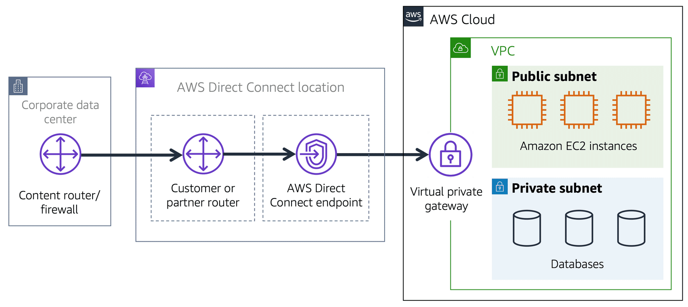

---
tags:
  - work
  - cloud
  - aws
  - aws-cloud-practitioner
created_on: "2025-03-05"
deck: Zettelkasten
modified_on: 2025-03-11 19:14:07
---

# AWS Direct Connect

AWS Direct Connect is a service to establish a dedicated private connection between your data centre and a [[amazon-virtual-private-cloud-vpc]].

## Analogy

Imagine that a coffee shop is the VPC and your home is the data centre and is directly above the coffee shop.

Only residents of the home can **directly** access the coffee shop by merely going downstairs. This dedicated and direct connection from AWS Direct Connect removes the requirement for users to travel the public road to the coffee shop.

## Concrete example

## Related content

- [Self-paced digital training on AWS - AWS Skill Builder](https://explore.skillbuilder.aws/learn/course/134/play/93606/aws-cloud-practitioner-essentials;lp=82)
- [[amazon-virtual-private-cloud-vpc]]
- [[aws-internet-gateway]]
- [[aws-virtual-private-gateway]]
- [[zettelkasten-for-work/zettelkasten/permanent/aws-direct-connect-provides-the-highest-security-with-the-lowest-latency]]

## Flashcards

For _Amazon VPC_, what is **AWS Direct Connect**? :: A service to establish a dedicated private connection between your data centre and a VPC.^1741208347422

For _connecting to Amazon VPC through AWS Direct Connect_, what is the **analogy**? :: Only residents of the apartment above the coffee shop can directly access the coffee shop by going downstairs. This dedicated and direct connection from AWS Direct Connect removes the requirement for users to travel the public road to the coffee shop.^1741208347436
