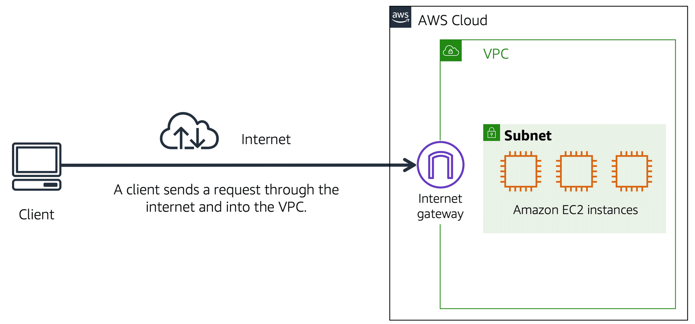

---
tags:
  - work
  - cloud
  - aws
  - aws-cloud-practitioner
created_on: "2025-02-04"
deck: Zettelkasten
modified_on: 2025-03-11 19:11:55
---

# AWS internet gateway

AWS has an [[internet-gateway]] to connect a [[amazon-virtual-private-cloud-vpc]] to the internet. This is public so anyone can access it.

This is the public version of the [[aws-virtual-private-gateway]].

## Analogy

Imagine the internet gateway as a door that customers use to enter a store. Without that door, no customers can access it.

## Concrete example

## Related content

- [Self-paced digital training on AWS - AWS Skill Builder](https://explore.skillbuilder.aws/learn/course/134/play/93606/aws-cloud-practitioner-essentials;lp=82)
- [[amazon-virtual-private-cloud-vpc]]
- [[aws-virtual-private-gateway]]

## Flashcards

For _Amazon VPC_, what is an **internet gateway**? :: A public connection to the VPC from the internet.^1738780555609

For _Amazon VPC internet gateway_, what is the **analogy**? :: A door for customers to enter a store.^1738780555627
