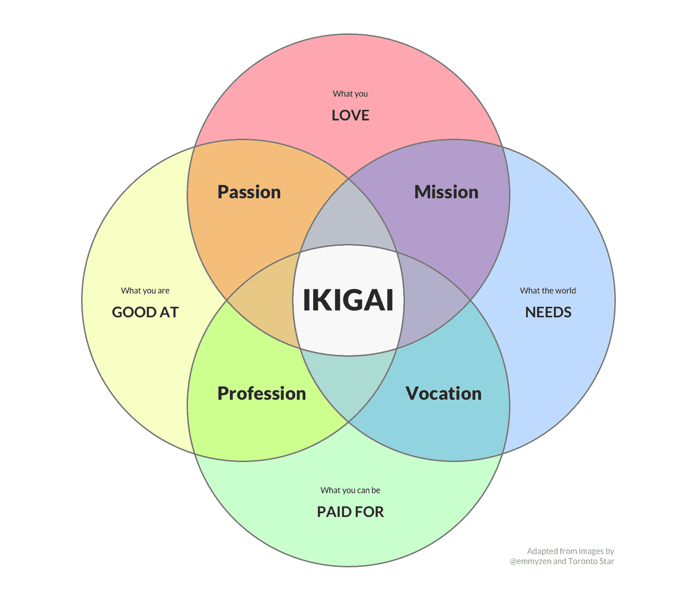

# Components of ikigai

[[ikigai]] combines our personal interpretations of the following to make our reason for existing:

- What do we love?
- What does the world need?
- What can you be paid for?
- What are you good at?

## Related content

- [Ikigai](../../books/ikigai.epub)

## Flashcards

What **4 questions**, _through our personal interpretations_, make one's IKIGAI? :: What we love doing, what we think the world needs, what we can be paid for, and what are our talents.^1710925696011
