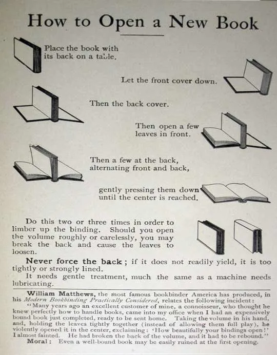

# How to break in a book

To break in a book:

1. Place the book with the spine on the surface.
2. Let the front cover down.
3. Let the back cover down.
4. Gently press down 10-20 pages from the front side.
5. Gently press down 10-20 pages from the back side.
6. Keep repeating steps 4 and 5 until there are no more pages to press down.
7. Keep repeating steps 1 - 6 until the book has been broken in.

The following is an image that demonstrates how to break in a book.

## Related content

- [BoingBoing](https://boingboing.net/2010/09/06/how-to-open-a-new-bo.html)

## Flashcards

What are the steps to **break in a book**? :: Place the book with the spine on the surface; let the front cover down; let the back cover down; gently press down 10-20 pages from the front side; gently press down 10-20 pages from the back side; keep repeating the last 2 steps until there are no more pages to press down; keep repeating the whole process until the book is broken in.^1723928336974

When *breaking in a book*, what is the **1st step**? :: Place the book with the spine on the surface.^1723928336987

When *breaking in a book*, what is the **2nd step**? :: Let the front cover down.^1723928336996

When *breaking in a book*, what is the **3rd step**? :: Let the back cover down.^1723928337006

When *breaking in a book*, what is the **4th step**? :: Gently press down 10-20 pages from the front side.^1723928337016

When *breaking in a book*, what is the **5th step**? :: Gently press down 10-20 pages from the back side.^1723928337025

When *breaking in a book*, what is the **6th step**? :: Keep alternating between pressing down pages from the front and back sides until there are no more pages to press down.^1723928337038

When *breaking in a book*, what is the **7th step**? :: Keep repeating the whole process until the book has been broken in.^1723928337047
