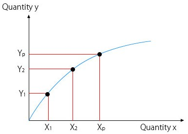

# Law of diminishing returns

Assuming other factors are constant, if a factor `x` produces `y`, there will be a point where adding more quantities of `x` will result in smaller increases of `y`.

## Flashcards

What is the **law of diminishing returns**? :: Additional input will result in ever-diminishing outputs.
^1676572838277
