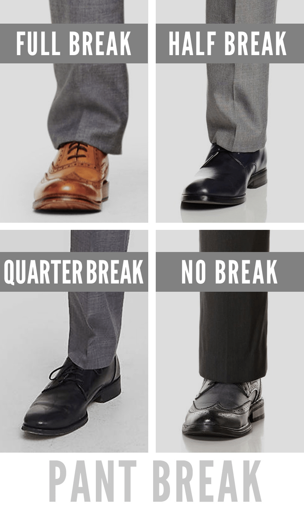

# Quarter or slight break in trouser

This type of [[trouser-break]] has the trouser slightly rest on the shoe, such that there is a little crease on top of the hem and very slightly breaks the structure of the trouser.

Refer to the bottom left of the image below:

---

## Related content

- [Real Men Real Style](https://www.realmenrealstyle.com/mans-trousers-break/)

## Flashcards

Regarding _trouser breaks_, what is a **quarter (slight) break**? :: A trouser break that slightly rests on top of the shoe.^1714827567322

Regarding _trouser breaks_, what does a **quarter (slight) break** look like? :: One little crease on top of the hem that very slightly breaks the structure of the trouser.^1714827567343
