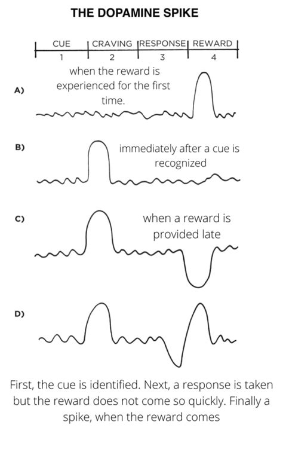

# Reinforcement learning in animals

[[reinforcement-learning]] can be observed in animals.

Consider the following image:

1. On figure A,
    - initial performance of an activity does not have any [[cue-in-terms-of-habits]] or [[craving-in-terms-of-habits]];
    - [[intensity-of-cognition-is-directly-correlated-to-novelty-of-stimuli]];
    - eventually, the appropriate [[response-in-terms-of-habits]] triggers a [[reward-in-terms-of-habits]] which also triggers a [[positive-reward-prediction-error]];
    - [[habit-rewards-teach-worthwhile-actions-for-the-future]] which can help the animal identify all 4 components in [[habits-are-made-of-cues-cravings-responses-and-rewards]].
2. In between figure A and figure B,
    - after several repetitions of figure A, [[dopamine]] spikes eventually transition from being part of the [[reward-in-terms-of-habits]] to a [[craving-in-terms-of-habits]];
    - this forms the following figures' diagrams.
3. On figure B,
    - once a [[habit]] has formed, the [[cue-in-terms-of-habits]] stimulates a [[craving-in-terms-of-habits]] through a [[dopamine]] spike;
    - on the expected [[reward-in-terms-of-habits]], a [[zero-reward-prediction-error]] occurs.
4. On figure C,
    - when figure B occurs but the expected [[reward-in-terms-of-habits]] is not provided, a [[negative-reward-prediction-error]] occurs and we get a reduction in [[dopamine]].
5. On figure D,
    - when figure C occurs but the expected [[reward-in-terms-of-habits]] comes late, a [[negative-reward-prediction-error]] initially occurs and we get a reduction in [[dopamine]];
    - when the [[reward-in-terms-of-habits]] finally arrives, a balancing [[positive-reward-prediction-error]] occurs which gives an equal [[dopamine]] spike;
    - overall, a [[zero-reward-prediction-error]] occurs.

For humans, [[reinforcement-learning]] can be simply explained in [[feedback-loop-of-all-human-behaviour]].

## Related content

## Flashcards

How does _reinforcement learning_ OCCUR in **animals**? :: Reinforcement learning in animals uses dopamine as the reward prediction error to encourage or discourage behaviour.^1716810562289
