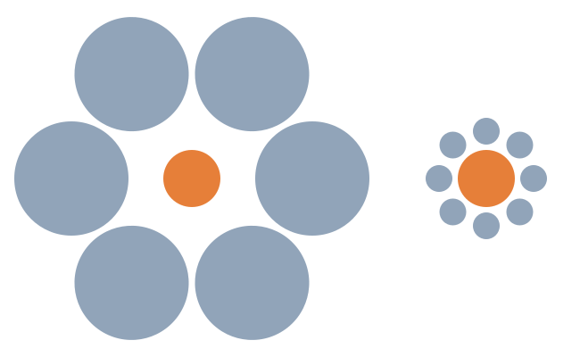

# Size-contrast illusion

The size-contrast illusion is an optical illusion of relative size perception.

Consider the following image. The yellow circle on the left appears smaller than the yellow circle on the left. Yet both are actually the same size.

## Related content

- [Wikipedia](https://wikiless.org/wiki/Ebbinghaus_illusion?lang=en)
- [[small-plates-can-help-with-food-portion-control]]
- [[small-plates-for-food-portion-control-are-less-effective-the-hungrier-a-person-is]]

## Flashcards

What is the **size-contrast illusion**? :: An optical illusion of relative size perception.^1711205165878
